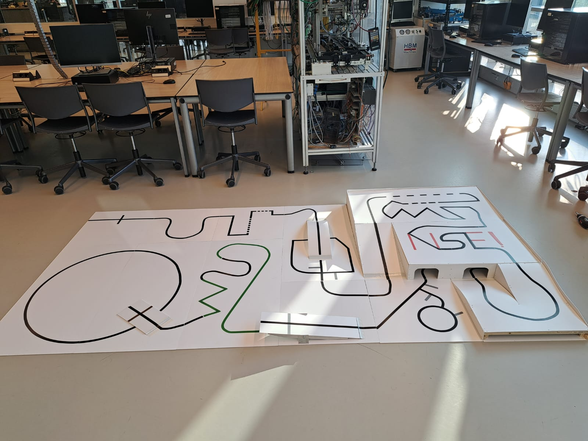

# zumo
The Hague University of Applied Sciences

NSE 1st year

Project Systems Engineering 

# aim

The aim of this project is the program a robot to follow a line. do when it sees a color it needs to remember what to do. while the project being instructed how to basic instructions works like throw.

also don't tell the [genius Tom](https://www.youtube.com/watch?v=KmwI_qnLSOg) about this project because WE HAVE ENOUTH JAVASRIPT

### dependecies
- arduino-cli (or ide) for compiling
- zumo32u4 robot & libary
- xbee or an alternative for `Serial1`

please follow the manufature's instructions for uploading code to the robot (https://www.pololu.com/docs/0J63/all)

there was a split between the demestarted code and another versions. please look at both versions (the second may not be functional)

both versions are in this repo:
- branch 1. Main
- branch 2. afther-3-day-split
